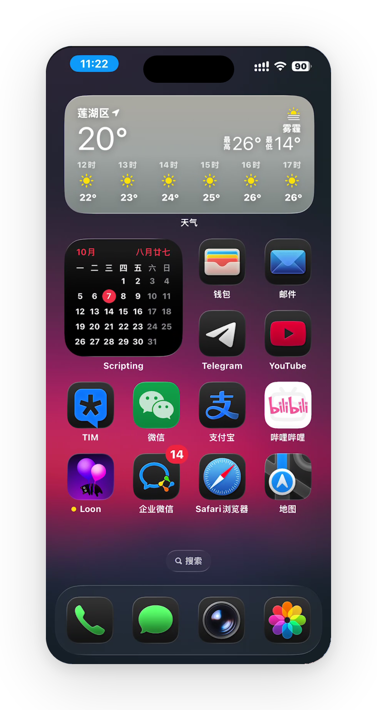
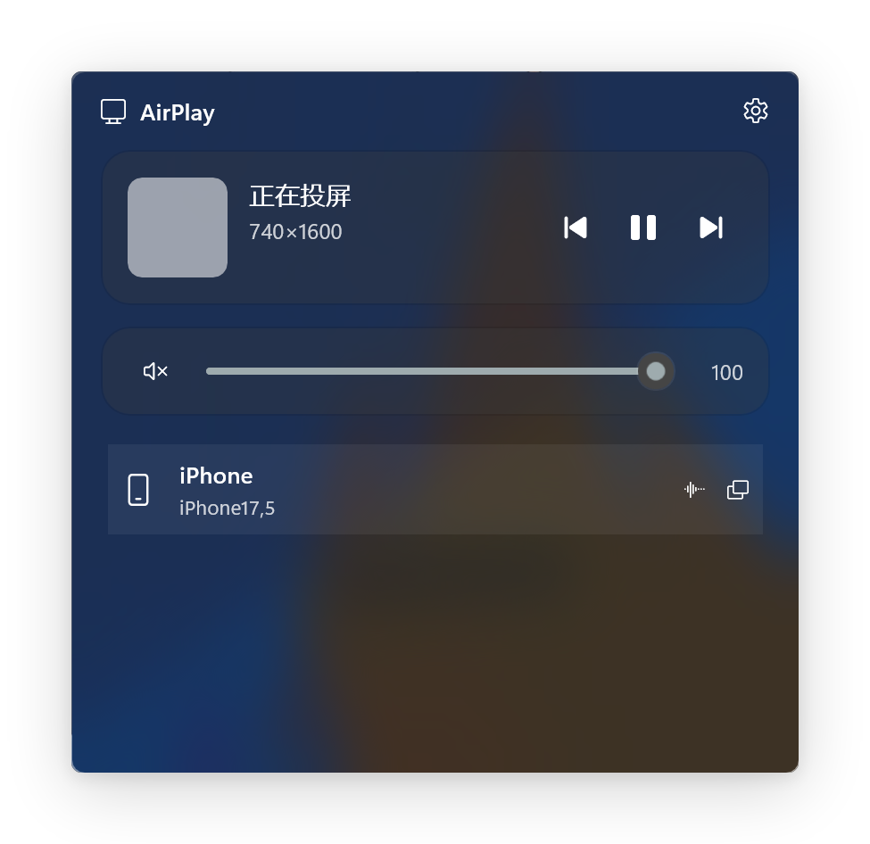

# AirPlay Windows App (ARM64)

将 Windows on ARM64 设备变为 AirPlay 接收器，支持 iPhone / iPad / Mac 屏幕镜像与音频投送。

基于 .NET 10 + WinUI 3 **自包含**打包，由 [natsurainko](https://github.com/natsurainko) 的 [原项目](https://github.com/natsurainko/Airplay.App) 适配 ARM64 并深度修复。

> 原作者：[natsurainko](https://github.com/natsurainko)
> 核心协议：[AirPlay.Core2](https://github.com/natsurainko/AirPlay.Core2)（已并入本仓库并修复投屏 / 配对等关键问题）

---

## 界面预览

<p align="center">
  
  &nbsp;&nbsp;
  
</p>

<p align="center">
  
</p>

*左：iPhone 屏幕镜像；中：控制面板（分区卡片布局）；右：视频镜像播放。*

---

## 功能

- [x] iPhone / iPad / Mac **屏幕镜像**（H.264，分辨率跟随屏幕，初始 85%，铺满无黑边）
- [x] **多设备**同时连接
- [x] AAC / AAC-ELD / ALAC 音频投送
- [x] `Win + Alt + A` 控制面板（中文界面，分区卡片布局）
- [x] 托盘菜单（打开控制面板 / 退出）
- [x] 正在播放信息（封面 / 歌手 / 专辑）
- [x] 悬浮控件实时 **FPS / 丢帧** 显示
- [x] 投屏窗口**迷你形态**（缩为右上角小条，点击还原）
- [x] 大屏模式（左侧竖直控制面板）+ **本地截图**到图片库
- [x] Apple 风格圆角（真·无边框，无白边）
- [x] **自包含打包**：内置 WindowsAppSDK 与 .NET 运行时，不受系统运行时更新影响

---

## 安装

### 方式一：安装已签名的 MSIX（推荐给普通用户）

1. 下载安装包与证书（同目录，两个文件都要）：
   - `AirPlay.App_1.0.2.0_arm64.msix`（约 146 MB）
   - `AirPlay.App_1.0.2.0_arm64.cer`（公钥证书）

2. **先装证书**（只需做一次，换证书时才需重做）：

   双击 `.cer` → 「安装证书」→ 选择 **本地计算机** → 「将所有证书放入下列存储」→
   **受信任的根证书颁发机构**。

   或用命令行（管理员 PowerShell）：

   ```powershell
   Import-Certificate -FilePath ".\AirPlay.App_1.0.2.0_arm64.cer" `
     -CertStoreLocation Cert:\LocalMachine\Root
   ```

3. **打开开发人员模式**：设置 → 系统 → 开发者选项 → 开发人员模式。

   若不想开开发人员模式，可对包手动签名后再装，但自签名证书仍需第 2 步。

4. 若装过旧版，先卸载：

   ```powershell
   Get-AppxPackage -Name "AirPlay.App" | Remove-AppxPackage
   ```

5. 安装：

   ```powershell
   Add-AppxPackage -Path ".\AirPlay.App_1.0.2.0_arm64.msix"
   ```

6. iOS / iPad / Mac 与 PC 连到**同一局域网** → 控制中心 → **屏幕镜像** → 选择 "AirPlay Windows App"。

> 本版本为**自包含**打包：内置运行时，不依赖系统组件，系统更新不会破坏应用。

### 方式二：从源码自行打包

需要 `.pfx` 私钥与密码才能产出**可安装**的包。完整流程、三种密码注入方式、
以及"能出包但装不上"等常见故障的排查，见 [docs/SIGNING.md](docs/SIGNING.md)。

```powershell
$env:AirPlayCertificatePassword = '你的pfx密码'
dotnet build AirPlay.App/AirPlay.App.csproj -c Release `
  -p:Platform=ARM64 -p:RuntimeIdentifier=win-arm64 `
  -p:AppxPackageDir=AppPackages-SelfContained/ `
  -p:GenerateAppxPackageOnBuild=true
```

> 加 `-p:AppxPackageSigningEnabled=false` 能出包，但产物**未签名、装不上**——那是给
> 纯粹做编译验证用的，不要分发。

---

## 使用提示

- 投屏窗口默认 85% 大小，铺满无黑边（窗口比例与画面不一致时自动裁剪）
- 投屏悬浮控件：设备信息、实时 FPS、最小化（缩为迷你条）、大屏、全屏、断开连接
- 控制面板：`Win + Alt + A` 或托盘图标打开
- **搜不到设备**：确认与 iPhone 同一 Wi-Fi、关闭路由器 AP 隔离、放行防火墙端口
  （仓库根目录 `open-airplay-ports.cmd` 一键放行 UDP 5353 / TCP 7100 / UDP 7000-7020 / TCP+UDP 5000-5020）
- 日志位置：`%LOCALAPPDATA%\Packages\AirPlay.App_*\LocalState\applog-*.txt`

---

## 文档

- [docs/SIGNING.md](docs/SIGNING.md) — 证书、签名密码、打包与故障排查
- [CHANGELOG.md](CHANGELOG.md) — 版本发布记录
- [AGENTS.md](AGENTS.md) — 项目结构与构建命令

---

## 许可证

MIT License © 2025 [natsurainko](https://github.com/natsurainko)
